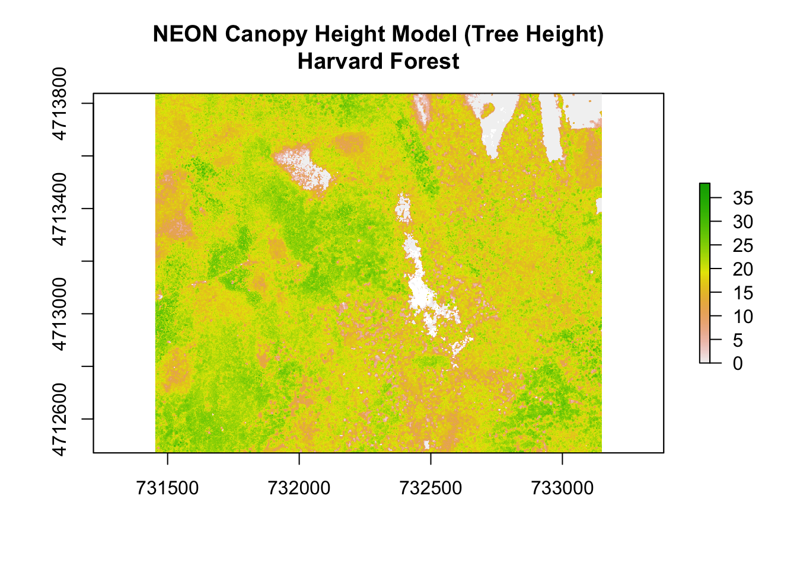
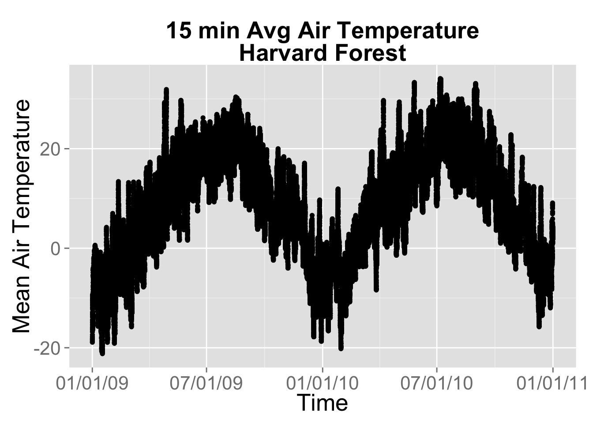

# Group 5 - Visualization: Making Pretty Maps and Plots

See notes: [Module Five - Making Pretty Maps & Plots - Google Docs](https://docs.google.com/document/d/1g6E8bxHtT-GZFh3T99l4laZra7jHwM0y8h-3Slr-MAE/edit#)

- To view rendered HTML, see [rawgit.com/.../group05_visualization.html]( https://cdn.rawgit.com/bbest/NEON-DC-DataLesson-Hackathon/code/group05_visualization.html)


## Learning Objectives

After completing this activity, you will know:

- Visual Outputs, generic to time series or maps
  - Outputting to different formats: pdf, png w/ resolution. html/pdf.
  - post-process in Adobe Illustrator or Inkscape
  - Titles, axes labels. margins.
  - Legends
  - Tiling / Faceting.
  - Color ramps. Choosing color ramps for types of data: categorical, continuous. - divergent. colorblind. Best practice for this data. Link out to more.
- Production Quality Maps, ie Cartography
  - Scalebar, projection, N arrow. map-specific
  - Symbology. pts, lines.
- Interactive
  - web-based interactive plot using Javascript libraries 
  - specifics for R today, htmlwidgets R packages: leaflet, dygraphs
- Animation
  - existing raster time series animation of chm tower air shed
  - add time series next to it. point / pixel of individual stations + average. min/max/avg:

How to import rasters into `R` using the raster library.
How to perform raster calculations in `R`.


```r
suppressPackageStartupMessages({
  library(raster)       # work with rasters
  library(dplyr)        # work with data frames
  library(rgdal)        # read/write spatial files, gdal = geospatial data abstraction library
  library(xts)          # time series
  library(ggplot2)      # plotting
  library(readr)        # readr::read_csv() preferable to read.csv()
  library(knitr)        # knitting Rmarkdown to html
  library(animation)    # create animation ot the NDVI outputs
  library(scales)       # breaks and formatting for ggplot2
  library(lubridate)    # work with time
  library(leaflet)      # interactive maps htmlwidget
  library(RColorBrewer) # color ramps
  library(dygraphs)     # interactive time-series htmlwidget
})

#set the working directory
wd = '~/github/NEON-DC-DataLesson-Hackathon/code/1_WorkshopData'
setwd(wd)
opts_knit$set(root.dir=wd)
```

## Quick Plot: Raster


```r
# read raster
chm <- raster("NEON_RemoteSensing/HARV/CHM/HARV_chmCrop.tif")

# see metadata
chm
```

```
## class       : RasterLayer 
## dimensions  : 1367, 1697, 2319799  (nrow, ncol, ncell)
## resolution  : 1, 1  (x, y)
## extent      : 731453, 733150, 4712471, 4713838  (xmin, xmax, ymin, ymax)
## coord. ref. : +proj=utm +zone=18 +datum=WGS84 +units=m +no_defs +ellps=WGS84 +towgs84=0,0,0 
## data source : /Users/bbest/github/NEON-DC-DataLesson-Hackathon/code/1_WorkshopData/NEON_RemoteSensing/HARV/CHM/HARV_chmCrop.tif 
## names       : HARV_chmCrop 
## values      : 0, 1098.62  (min, max)
```

```r
# quick plot
plot(chm, main="NEON Canopy Height Model (Tree Height)\nHarvard Forest")
```




## Production Quality Plot: Raster


```r
#customize legend, add units (m), remove x and y labels
```

## Interactive Plot: Raster


```r
# project if not already in mercator for leaflet
chm_mer = projectRasterForLeaflet(chm)

# get color palette
pal = colorNumeric(rev(brewer.pal(11, 'Spectral')), values(chm_mer), na.color = "transparent")

# output interactive plot
leaflet() %>%
  addTiles() %>%
  addProviderTiles("Stamen.TonerLite", options = providerTileOptions(noWrap = TRUE)) %>% 
  addRasterImage(chm_mer, colors=pal, project=F, opacity=0.8) %>%
  addLegend(pal=pal, position='bottomright', values=values(chm_mer), title='CHM')
```

preserve27a088556f480af2


## Production Plot: Time-Series


```r
harMet = read.csv('AtmosData/HARV/hf001-10-15min-m.csv')

#clean up dates
#remove the "T"
#harMet$datetime <- fixDate(harMet$datetime,"America/New_York")

# Replace T and Z with a space
harMet$datetime <- gsub("T|Z", " ", harMet$datetime)
  
#set the field to be a date field
harMet$datetime <- as.POSIXct(harMet$datetime,format = "%Y-%m-%d %H:%M", 
                          tz = "GMT")

#list of time zones
#https://en.wikipedia.org/wiki/List_of_tz_database_time_zones
#convert to local time for pretty plotting
attributes(harMet$datetime)$tzone <- "America/New_York"

#subset out some of the data - 2010-2013 
yr.09.11 <- subset(harMet, datetime >= as.POSIXct('2009-01-01 00:00') & datetime <=
as.POSIXct('2011-01-01 00:00'))

#as.Date("2006-02-01 00:00:00")
#plot Some Air Temperature Data
  
myPlot <- ggplot(yr.09.11,aes(datetime, airt)) +
           geom_point() +
           ggtitle("15 min Avg Air Temperature\nHarvard Forest") +
           theme(plot.title = element_text(lineheight=.8, face="bold",size = 20)) +
           theme(text = element_text(size=20)) +
           xlab("Time") + ylab("Mean Air Temperature")


#format x axis with dates
myPlot + scale_x_datetime(labels = date_format("%m/%d/%y"))
```

```
## Warning: Removed 2 rows containing missing values (geom_point).
```




## Interactive Plot: Time-Series


```r
# drop duplicate datetimes and assign rownames for later conversion to xts
ts = yr.09.11[!duplicated(as.character(yr.09.11$datetime)),]
row.names(ts) = as.character(ts$datetime)

date_window = row.names(ts)[c(
  which.max(row.names(ts) >= '2010-01-01 00:00:00'),
  which.min(row.names(ts) < '2011-01-01 00:00:00'))]

# plot
ts %>%
  select(airt) %>%
  as.xts() %>%
  dygraph() %>%
    dyRangeSelector(date_window)
```

preserveca86c2085cd23f27


